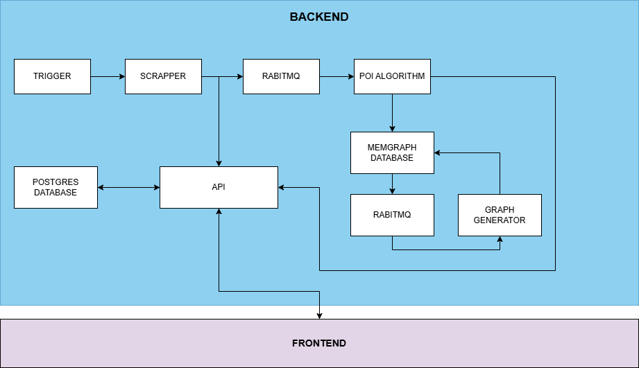
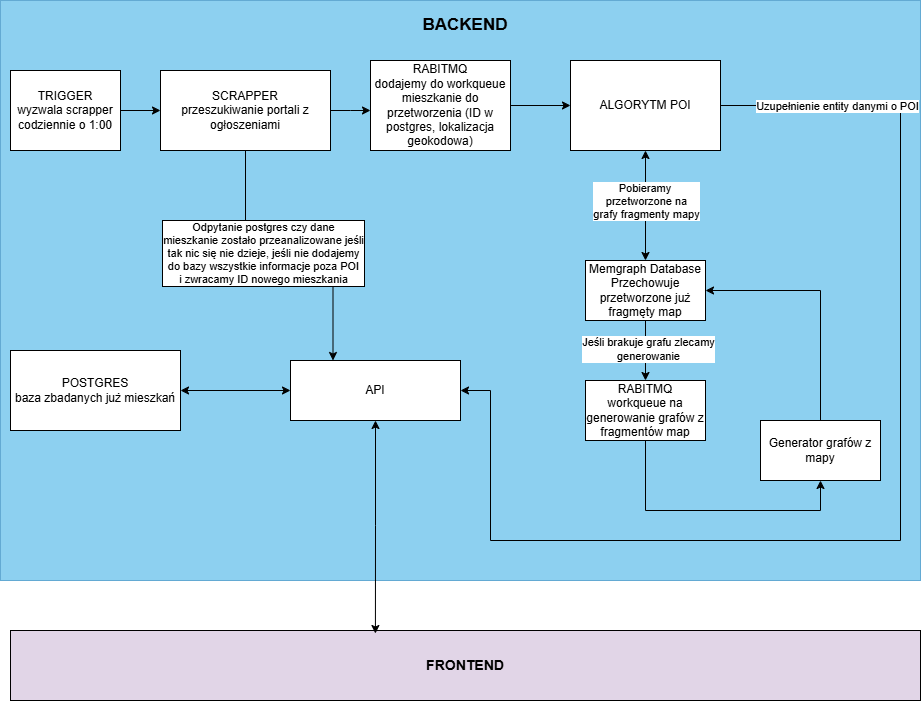

[PL]
# BACKEND
Backend systemu służy do automatycznego przeszukiwania ogłoszeń o mieszkaniach, analizy ich lokalizacji, wzbogacania danych o punkty zainteresowania (POI) oraz prezentacji informacji użytkownikom poprzez API.

## KOMPONENTY

### TRIGGER
Odpowiada za inicjację procesu przeszukiwania portali z ogłoszeniami kupna mieszkań tzw. scrapping, codziennie o 1:00 rano.

### SCRAPPER
Pobiera ogłoszenia o mieszkaniach z wyznaczonych portali internetowych.

### POSTGRES
Baza danych z informacjami o mieszkaniach już przeanalizowanych przez system.

### API
Centralna część backendu, udostępniająca dane mieszkaniowe do innych komponentów oraz do frontend-u aplikacji.

## Przetwarzanie nowych ogłoszeń
1. Scrapping
Po uruchomieniu scrappera, nowe dane z ogłoszeń są sprawdzane pod kątem obecności w bazie danych (POSTGRES).

2. Analiza lokalizacji
Jeśli mieszkanie nie było wcześniej analizowane, wszystkie informacje (z wyjątkiem danych o POI) są zapisywane w bazie i generowane jest nowe ID mieszkania.

## Analiza lokalizacji i wzbogacenie POI
### RabbitMQ
Oferty mieszkań są wysyłane do kolejki RabbitMQ, gdzie czekają na przetworzenie algorytmem POI.

### Algorytm POI
Przetwarza oferty, uzupełniając je o informacje dotyczące lokalizacji oraz punktów zainteresowania (POI).

## Generowanie grafów lokalizacyjnych
### Memgraph Database
Przechowuje przetworzone już fragmenty map oraz powiązane grafy.

### Generator grafów
Jeśli dla lokalizacji brakuje grafu, system zleca jego wygenerowanie poprzez osobną kolejkę (queue) w RabbitMQ.

### Przetworzone grafy
Przetworzone grafy wracają do bazy danych Memgraph i są dostępne do dalszej analizy.

## Interfejs API
API umożliwia komunikację pomiędzy bazą danych, algorytmem POI oraz frontendem, obsługując odpytywanie o oferty oraz wyniki analiz POI i grafów.

### Eksport dokumentacji API

Aby wyeksportować dokumentację API do statycznych plików HTML:

```bash
python export_docs.py
```

Skrypt generuje:
- `docs/openapi.json` - schemat OpenAPI w formacie JSON
- `docs/redoc.html` - interaktywna dokumentacja ReDoc (można otworzyć w przeglądarce)
- `docs/swagger.html` - interaktywna dokumentacja Swagger UI (można otworzyć w przeglądarce)

Oba pliki HTML są w pełni interaktywne i działają offline (używają CDN dla bibliotek).

## Schemat przepływu danych
1. Trigger codzienny uruchamia pobieranie nowych ogłoszeń.

2. Scrapper przekazuje nowe dane systemowi i kolejce RabbitMQ.

3. API sprawdza, czy dana oferta znajduje się już w systemie.

4. Nowe oferty są analizowane algorytmem POI oraz, w razie potrzeby, generowane są grafy lokalizacji.

5. Przetworzone dane trafiają do bazy i są dostępne dla użytkownika poprzez frontend.

[ENG]
# BACKEND
The system's backend is used for automatically searching for apartment listings, analyzing their location, enriching the data with Points of Interest (POI), and presenting the information to users via an API.

## COMPONENTS
### TRIGGER
Responsible for initiating the process of searching apartment buying portals, known as scrapping, daily at 1:00 AM.

### SCRAPPER
Downloads apartment listings from designated internet portals.

### POSTGRES
A database containing information about apartments already analyzed by the system.

### API
The central part of the backend, providing apartment data to other components and to the application's frontend.

## Processing New Listings
1. Scrapping After the scrapper is launched, new listing data is checked for presence in the database (POSTGRES).

2. Location Analysis If the apartment has not been analyzed before, all information (except for POI data) is saved in the database, and a new apartment ID is generated.

## Location Analysis and POI Enrichment
### RabbitMQ
Apartment offers are sent to the RabbitMQ queue, where they await processing by the POI algorithm.

### POI Algorithm
Processes the offers, supplementing them with information regarding location and Points of Interest (POI).

## Generating Location Graphs
### Memgraph Database
Stores already processed map fragments and associated graphs.

### Graph Generator
If a graph is missing for a location, the system commissions its generation via a separate queue in RabbitMQ.

### Processed Graphs
Processed graphs return to the Memgraph database and are available for further analysis.

## API Interface
The API enables communication between the database, the POI algorithm, and the frontend, handling queries for listings and the results of POI and graph analyses.

## Data Flow Diagram
1. The daily Trigger starts the download of new listings.

2. The Scrapper passes the new data to the system and the RabbitMQ queue.

3. The API checks if the offer is already in the system.

4. New offers are analyzed by the POI algorithm, and, if needed, location graphs are generated.

5. Processed data is stored in the database and is available to the user via the frontend.

# DATAFLOW




